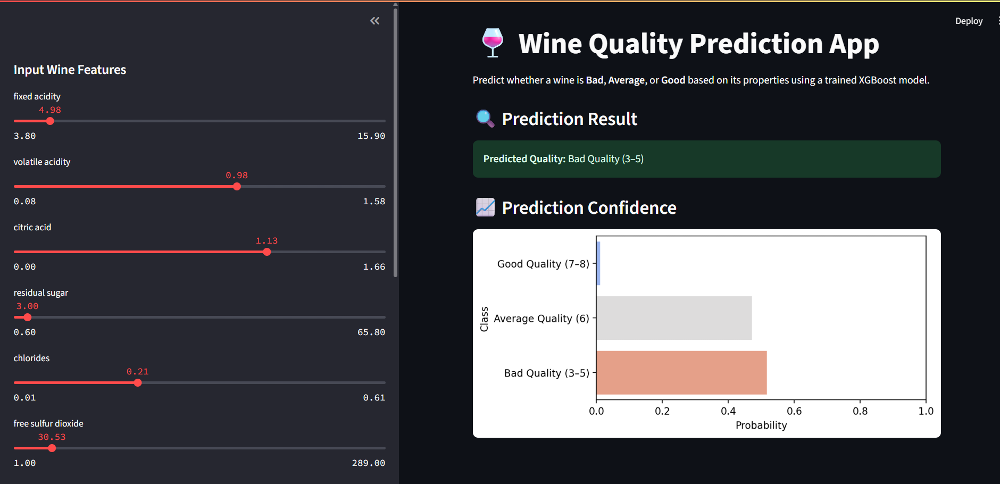
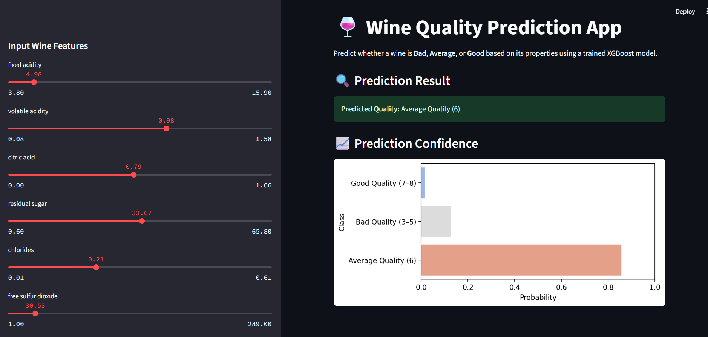
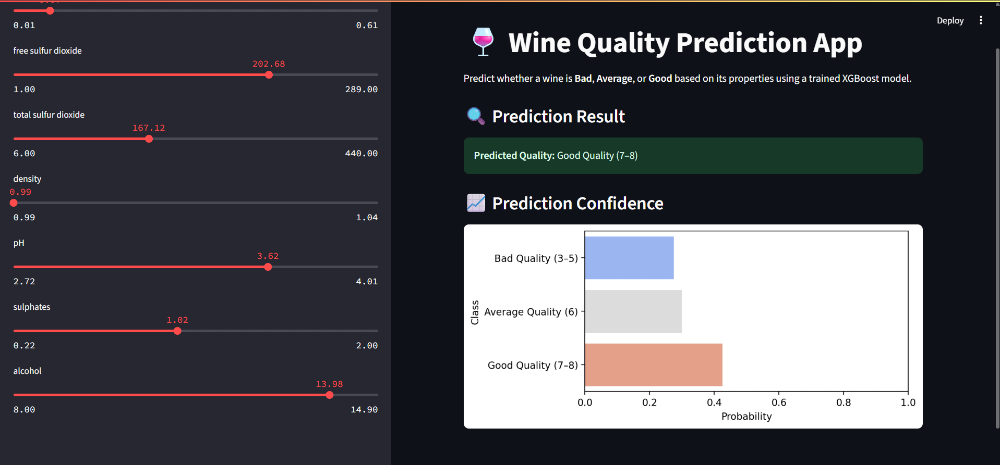

# 🍷 Wine Quality Predictor

A machine learning project that classifies wine quality (Bad, Average, Good) using physiochemical features like acidity, sugar, pH, alcohol, etc. The model has been deployed using **Streamlit** for an interactive web interface.

---

## 🚀 Features

- ✅ Predicts wine quality (Bad, Average, Good) using XGBoost classifier
- 📈 Trained and tested on both red and white wine datasets
- 🎛️ Feature scaling with PowerTransformer
- 📊 Streamlit web interface with sliders for input features
- 📉 Evaluation of multiple classifiers for benchmarking
- 🧠 Final model achieves **high precision on class 2 (Good Quality)**

---

## 📊 Classifier Comparison

| Model                | Accuracy | Precision | Recall | F1-Score |
|---------------------|----------|-----------|--------|----------|
| Logistic Regression | 65.04%   | 0.65      | 0.65   | 0.65     |
| KNN Classifier       | 70.56%   | 0.70      | 0.70   | 0.70     |
| SVM Classifier       | 72.44%   | 0.72      | 0.72   | 0.72     |
| Decision Tree        | 67.86%   | 0.68      | 0.68   | 0.68     |
| Random Forest        | 74.26%   | 0.74      | 0.74   | 0.74     |
| Gradient Boosting    | 73.80%   | 0.74      | 0.74   | 0.74     |
| **XGBoost (Final)**  | **74.04%** | **0.79 (class 2)** | **0.83 (class 2)** | **0.81 (class 2)** |

> 📌 *The XGBoost classifier was selected as the final model due to its strong performance on the "Good Quality" (class 2) category.*

---

## 🧪 Input Features Used

- Fixed acidity  
- Volatile acidity  
- Citric acid  
- Residual sugar  
- Chlorides  
- Free sulfur dioxide  
- Total sulfur dioxide  
- Density  
- pH  
- Sulphates  
- Alcohol

---

## 📸 Streamlit Web App Preview

## 🍷 Quality Classification Visuals

| Bad Quality | Average Quality | Good Quality |
|-------------|------------------|----------------|
|  |  |  |


---

## 🧾 Project Structure

```
WineQualityPredictor/
│
├── Saved_model/
│   ├── xgboost_model.pkl   
│   ├── scaler.pkl           # Fitted PowerTransformer

├── dataset/
│   ├── winequality-red.csv
│   └── winequality-white.csv
│
├── notebooks/
│   ├── logistic_regression.ipynb
│   ├── svm_classifier.ipynb
│   ├── random_forest.ipynb
│   └── ... other model experiments
│   ├── app.py
└── README.md

```

---

## 🛠️ Run the App Locally

1. Clone the repository:
   ```bash
   git clone https://github.com/rishabh151103/WineQualityPredictor.git
   cd WineQualityPredictor/app
   ```

2. Install dependencies:
   ```bash
   pip install -r requirements.txt
   ```

3. Run the app:
   ```bash
   streamlit run app.py
   ```

---

## 📌 Requirements

- Python ≥ 3.10  
- scikit-learn  
- xgboost  
- pandas  
- numpy  
- matplotlib  
- seaborn  
- streamlit  

You can create a `requirements.txt` using:

```bash
pip freeze > requirements.txt
```

---

## 📧 Author

**Rishabh Gaur**  
GitHub: [rishabh151103](https://github.com/rishabh151103)

---

## ⭐️ Star the repo if you found it helpful!
